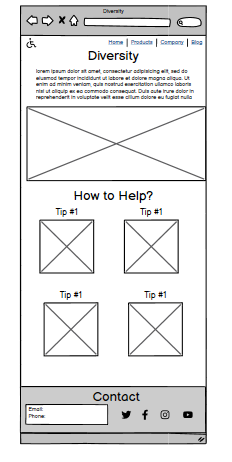

# Accessible Workplaces

---

## Live Site
https://seanmatthews26.github.io/diversity-site/

---

## Introduction
Accessible Workplaces is a resource hub dedicated to helping organizations create inclusive and accessible environments for people with disabilities.  
The website provides tips, guidance, and external resources to support workplaces where everyone can thrive.

---

## Responsive Design Preview
Below are two pcitures of the tips section, in mobile and tablet display.

---

## Contents
- [UX Design](#ux-design)
  - [User Stories](#user-stories)
  - [Strategy](#strategy)
  - [Scope](#scope)
  - [Structure](#structure)
  - [Skeleton](#skeleton)
  - [Surface](#surface)
- [Website Features](#website-features)
- [AI Use](#ai-use)
- [Future Features](#future-features)
- [Technologies Used](#technologies-used)
- [Deployment](#deployment)
- [Testing](#testing)
- [Credits](#credits)

---

## UX Design

### User Stories
- As an **employer**, I want clear and practical tips on accessibility so I can make my workplace more inclusive.  
- As a **disabled employee**, I want to know my workplace can support my needs with accommodations and resources.  
- As an **HR manager**, I want external resources I can use to train staff and ensure compliance.  
- As a **visitor**, I want simple navigation and accessible content so I can find what I need quickly.  

### Strategy
The website is designed to provide concise, actionable content for organizations looking to improve accessibility, while also being easy to navigate and mobile-friendly.  

### Scope
The site focuses on three key areas:  
1. **Tips** – Practical advice for making workplaces inclusive.  
2. **Resources** – External links to expert organizations.  
3. **Contact** – A simple way for users to connect.  

### Structure
The content is organized into clear sections (Home, Tips, Resources, Contact), accessible through the navigation bar.  

### Skeleton
 

### Surface
The site uses a clean, professional layout with Bootstrap styling. Images are chosen to reflect real workplace diversity and accessibility. Font Awesome icons are used for visual cues.  

---

## Website Features
- **Responsive Navbar** with accessible aria-labels and clear navigation.  
- **Hero Section** introducing the site with text and image.  
- **Tips Section** with cards highlighting practical accessibility practices.  
- **External Resources Section** with curated links to authoritative organizations.  
- **Footer** with contact information and social media links.  

---

## AI Use
- ChatGPT was used to help fix an issue when testing the HTML. The AI correctly found that closing brackets ( /> ) were used when they should not have been.

## Future Features
- A blog section with articles on accessibility best practices.  
- Searchable directory of accessibility tools and services.  
- Downloadable resources (checklists, policy templates).  
- Multi-language support.  

---

## Technologies Used
- **HTML5** – Structure and semantic content.  
- **CSS3** – Custom styles.  
- **Bootstrap 5.3.7** – Responsive grid system and components.  
- **Font Awesome** – Icons for accessibility and social links.  
- **Git/GitHub** – Version control and hosting.  
- **ChatGPT** – Generative text AI used in testing.  

---

## Deployment
The project was developed using GitHub and deployed using GitHub Pages.  

**Steps to deploy:**  
1. Navigate to repository settings in GitHub.  
2. Scroll to **Pages** section.  
3. Select `main` branch as the source.  
4. Save settings – the site will be live at the provided URL.  

---

## Testing
- **Responsiveness**: Tested across multiple screen sizes (mobile, tablet, desktop).  
- **Accessibility**: Checked with semantic HTML, alt text for images, and aria-labels for links.  
- **Functionality**: All navigation links, external resources, and social links tested successfully.  

---

## Credits
- **Content & Design**: Created by Sean Matthews.  
- **Images**: [Pexels](https://www.pexels.com/) – free-to-use stock photos.  
- **Icons**: [Font Awesome](https://fontawesome.com/).  
- **Framework**: [Bootstrap](https://getbootstrap.com/).  
- **Inspiration & Resources**: Accessibility guidance from JAN, AbilityNet, and EARN.  

---
